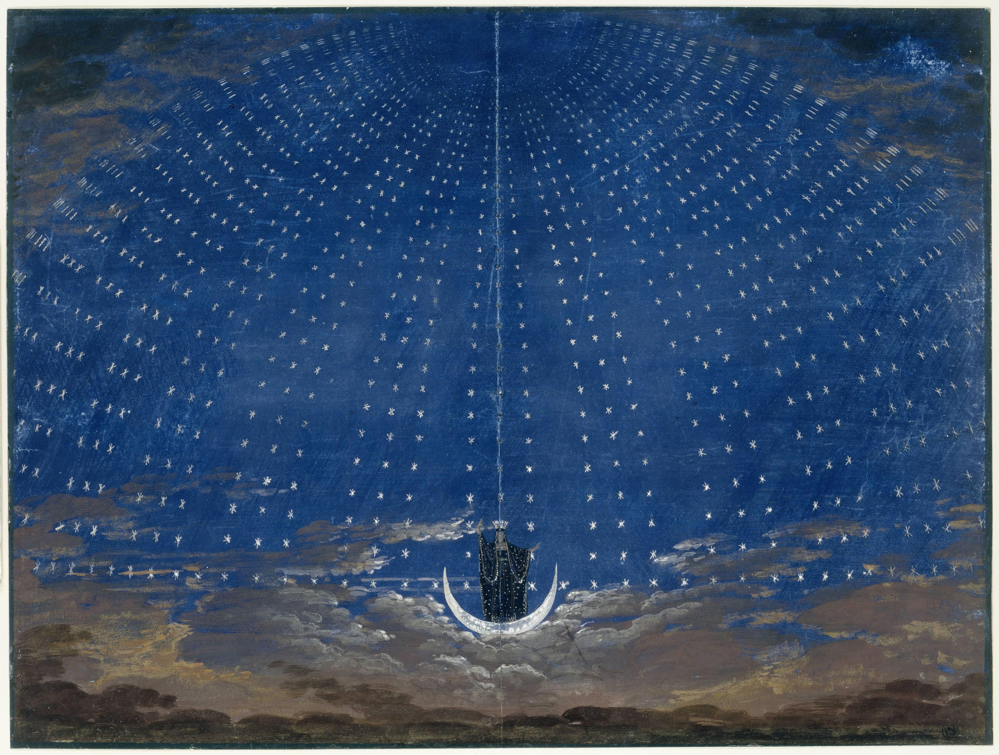
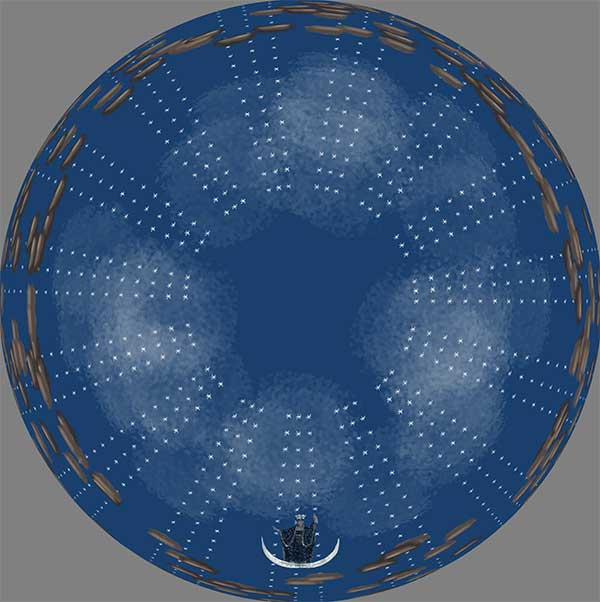

# The Magic Flute Stage Set

Here we've made a animated p5.js based version of the lovely background set designed by Karl Friedrich Schinkel for Mozart's [Magic Flute](https://en.m.wikipedia.org/wiki/The_Magic_Flute) (1815 production)

See it live here [Magic Flute FullDome Set](https://ccnyplanetarium.org/art-and-science-on-the-dome/p5-to-dome/magic-flute/)

The original looks like this: 

The fulldome version is:

